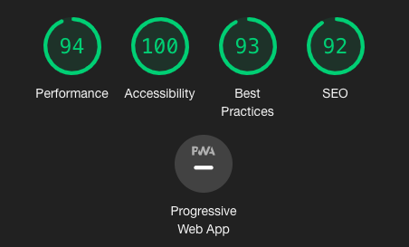

# Milestone Project 1: Mill Comedy - Comedian Website

## [Mill Comedy](https://robert-clark-1990.github.io/MSP1_Mill_Comedy/)

This is the website for the up and coming comedian/podcaster/screenwriter, Milly Armstrong Clark. 
It is designed to be responsible and accessible on a range of devices, making it easy for users to keep up to date with Milly's projects or upcoming events and communicate with her through the use of a contact form.

This project has been built using the five planes of UX design to develop a site that is focused in its needs and objectives, and provides a high quality experience for the user.

# Strategy

The two main site objectives for this website are as follows: 

* To create an experience that gives the user a clear understanding of Milly’s creative stylings through the use of colour, images, and written content.

* To showcase a creative curriculum vitae of Milly’s work for potential clients or producers who may be interested in working with her.

The user needs are outlined below in the User Stories.

# User Experience (UX)

### User Stories

#### First-time visitors

1. As a first-time visitor, I want to be able to easily understand the purpose of the site, and navigate through the sections with ease.

2. As a first-time visitor, I want to be able to find information pertaining to Milly Armstrong Clark's upcoming or ongoing projects.

3. As a first-time visitor, I want to be able to easily locate social media links, and be able to contact Milly through an inbuilt contact form.

#### Returning visitors

1. As a returning visitor, I want to be able to easily locate necessary information such as podcast or stand up video links.

2. As a returning visitor, I want to be able to easily access links to social media.

#### Potential Client

1. As a potential client, I want to be able to gain an understanding of Milly’s creative style through the content provided.

2. As a potential client, I want to have an easily accessible contact form to reach Milly.

### Design

#### Colour Scheme

A colour palette of pink, purple and white have been selected to match the predetermined palette used for the "Tea with the Morale Queen" podcast.

#### Typography

There are two main fonts that have been used for the website:

1. "Alatsi" is used for all headings and list items.

2. "Roboto" is used for all paragraph text.

#### Images
Striking images of comedian, Milly Armstrong Clark have been used throughout the site to uphold a state of continuity.
These images reflect the style of comedy used in her work, building consistensy in both the site and her work as soon as the user interacts with the site.

#### Wireframes

In preparation for this project, a basic wireframe of each page and how it would be viewed in desktop, tablet and mobile has been created.
The wireframe for this project can be viewed [here](assets/doc/mc-wireframes.pdf).

#### Mock-ups

In preparation for this project, a basic mock-up of each page has been created to show the intended style of the website as a whole.
The mock-ups for this project can be viewed [here](assets/doc/mc-mockup.pdf).

# Features

### Existing Features

1. Home page - This page utilises a clean, professional look to welcome users to the site. A comedic element exists on the homepage, wherein the user can hover over the image of Milly which swaps it to an image of her pulling a face.

2. About page - A short background on Milly's life, both personally and professionally, with an image of her to accompany it.

3. Podcast page - A clean page detailing Milly's podcast, Tea with the Morale Queen, with an embedded element to listen to the most recent podcast, subscribe via a selection of icons, and a support button for those looking to support the podcast.

4. Stand Up page - Following a brief description of her comedic style, users can watch sets from Milly's previous performances.

5. News page - A page of news articles presented in date order, with images and necessary links provided.

6. Contact page - A clean contact form for users to get in touch with Milly.

### Features left to implement

1. In order to expand on the full vision of Milly's work, a page dedicated to her wildlife work will be added at a future date.

2. Upon the creation of a mailing list, this will be implemented into the site, with a modal Call to Action on the homepage, a link in the footer, and inclusion on the Contact page.

3. A media page will be added at a future date to include official images of Milly for professional use.

# Technologies used

### Languages Used

1. HTML5

2. CSS3

### Frameworks, Libraries & Programs Used

1. [Bootstrap v4.5.3](https://getbootstrap.com/)
    
    Bootstrap was used to assist with the responsiveness and styling of the website.

2. [Google Fonts](https://fonts.google.com/)
    
    Google Fonts was used to import the "Alatsi" and "Roboto" fonts.

3. [Font Awesome](https://fontawesome.com/)
    
    Font Awesome was used on all pages to provide icons for aesthetic and UX purposes.

4. [Git](https://git-scm.com/)
    
    Git was used for version control, utilising the Gitpod terminal to commit to Git and Push to GitHub.

5. [GitHub](https://github.com/)
    
    GitHub was used to store the project.

6. [Adobe Photoshop](https://www.photoshop.com/en)
    
    Adobe Photoshop was used to create the background, and edit photos used throughout the website.

7. [Codepen.io](https://codepen.io)

    Codepen was used for reference of homepage hover functionality.

8. [Online Convert](https://image.online-convert.com/convert-to-webp)

    Online Convert was used to turn images into webp format.

# Testing

## Site performance

During the testing process, the website was subjected to a Lighthouse report to identify and fix common problems that affect the site's performance, accessibility and user experience.
The report brought back the following results.

It was clear there was work to be done on improving the site's performance, especially with the hover image on the home page. 
Upon review, it was discovered a fix would be to convert images from jpeg or png to webp, so this was done using an [online converter](https://image.online-convert.com/convert-to-webp).
This reduced load times, bringing the performance up into the 90s.

## Site Containers

Throughout development, the website seemed unresponsive and clung to the margins of the browser despite efforts made to counter this. 
In a last ditch attempt to fix it, the entire homepage was rebuilt from scratch to see if the issue would persist, and low and behold, the issue was the lack of a container div, 
within which the row and col divs had free reign to hug the browser margins. This fix has made the site much more attractive to view.

# Deployment

This project was created using **Gitpod**, and pushed to **GitHub**. To deploy this page to GitHub from it's GitHub repository, the following steps were taken:

1. Visit [GitHub](https://github.com/) and log in.

2. From the repositories, select **Robert-Clark-1990/MSP1_Mill_Comedy**.

3. From the GitHub repository, click on **Settings**.

2. Scroll down to the section entitled **GitHub Pages**.

3. From the dropdown menu beneath **Source**, selected the **Master branch** and hit **save**.

4. This will create a link, visible just **below the GitHub Pages title**, which will take you to the deployed website.

### Running this project locally

To clone this project into Gitpod you will need:

1. A GitHub account.

2. Access to the Chrome browser.

Then follow these steps:

1. Install the Gitpod Browser Extensions for Chrome and restart your browser.

2. Log into Gitpod and navigate to the Project GitHub repository.

3. Click the green **"Gitpod"** button at the top of the repository.

# Credits

### Content

* All written content was created by the developer, Robert Clark with permission from [Milly Armstrong Clark](https://www.instagram.com/millcomedy/).

### Media

* All images were created by the developer, Robert Clark, with permission from [Milly Armstrong Clark](https://www.instagram.com/millcomedy/).

* All podcasts and videos provided used with permission from [Milly Armstrong Clark](https://www.youtube.com/channel/UCm8_k81-p_cEimTHmhDOB-w).

* Confidence for Breakfast artwork was created by the developer, Robert Clark, with permission from [Melanie Judson](https://www.instagram.com/confidenceforbreakfast/).

### Acknowledgements

* Thanks to [Milly Armstrong Clark](https://www.instagram.com/millcomedy/) for allowing this project to be based on her incredible work.

* Thanks to Slack User Healycian90 for their help recovering work not pushed to GitHub.

* Thanks to Slack User Ciaran Brady for their help locating the image swap hover code.

* Thanks to [Creative Programmer](https://codepen.io/creativeprogrammer/pen/RpBpgm) for their image swap on hover code that was used for the homepage of this project.

* Thanks to [Andor Nagy](https://codepen.io/andornagy/pen/RNeydj?editors=1100) for their responsive navbar that was used as a guideline and adapted for this project.

